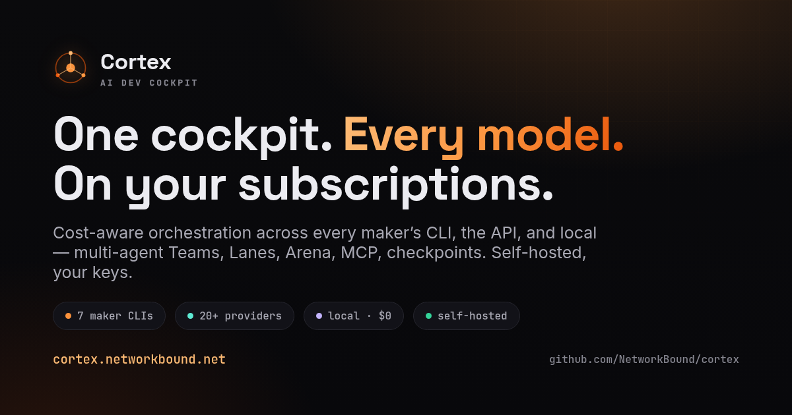

<p align="center">
  
</p>

<h1 align="center">Cortex</h1>

<p align="center">
  <b>One cockpit. Every model. On your subscriptions.</b><br>
  A self-hosted AI dev cockpit that drives every maker's CLI on the plans you already pay&nbsp;for.
</p>

<p align="center">
  
  
  
  
</p>

<p align="center">
  <a href="https://cortex.networkbound.net"><b>Website</b></a> ·
  <a href="https://github.com/NetworkBound/cortex/releases/latest"><b>Download</b></a>
</p>

---

## ⬇️ Download

Grab the latest from **[Releases](https://github.com/NetworkBound/cortex/releases/latest)**:

| Platform | File |
|---|---|
| 🐧 Linux (universal) | `Cortex_*_amd64.AppImage` — `chmod +x`, then run |
| 🐧 Debian / Ubuntu | `Cortex_*_amd64.deb` |
| 🎩 Fedora / RHEL | `Cortex-*.x86_64.rpm` |
| 🍎 macOS (Apple Silicon / Intel) | `Cortex_*_aarch64.dmg` · `Cortex_*_x64.dmg` |
| 🪟 Windows 10/11 | `Cortex_*_x64-setup.exe` (per-user, no admin) |

> Windows/macOS builds are unsigned — SmartScreen / Gatekeeper will warn on first launch; allow it through.

---

## ✨ What it is

Cortex is **one desktop window that orchestrates every coding agent you already pay for**. It drives each maker's CLI — Claude, Codex, Gemini, Qwen, Grok and more — **headless, under your own subscription**, instead of metered API tokens. A lead model decomposes each task, a **capability- and cost-aware router** sends every subtask to the cheapest model that can actually do it, code work runs in **isolated git-worktree Lanes**, and a synthesis pass verifies and merges the result — all on your own box, keys sealed in the OS keychain, no phone-home.

## 🚀 Highlights

- **🪙 Runs on your subscriptions** — maker CLIs sign in with the plan you already have; no per-token bills, no key ever leaves your machine.
- **🧭 Cost-aware orchestration** — capability-gated *before* price, so a chat-only model never touches your shell. Easy work routes to the cheapest capable model (free local Ollama wins ties); hard work routes to the strongest.
- **👥 Multi-agent** — **Teams** (a manager + specialist workers), **Lanes** (the same task across providers in isolated worktrees), **Arena** (head-to-head A/B with a persistent ELO leaderboard).
- **🧩 20+ providers, three ways in** — 7 maker CLIs · 13 OpenAI-compatible APIs · 6 local runtimes.
- **🔌 MCP catalog** — a real JSON-RPC MCP client plus a one-click catalog of servers; give every model the same tools.
- **⏪ Checkpoints + /undo** — git-independent workspace snapshots; preview the exact diff before any rollback.
- **🛡️ Yours & safe** — untrusted-by-default sandbox, safe-command allowlist, OS-keychain-sealed keys, ed25519-signed updates.

## 🔱 Providers

| Tier | Sign in with | Examples |
|---|---|---|
| **CLI · your subscription** | each maker's own login | Claude · Codex · Gemini · Qwen · Grok · aider · Mistral Vibe |
| **OpenAI-compatible API** | a base URL + key | Groq · Together · Fireworks · DeepSeek · Mistral · xAI · Perplexity · OpenRouter · Kimi · Cohere · … |
| **Local runtime · $0** | localhost | Ollama · LM Studio · vLLM · llama.cpp · TabbyAPI · Text-Gen-WebUI |

Keys live in the OS keychain and are re-read every run. Self-hosted; nothing phones home.

## 🛠️ Build from source

Needs **Node 22 + pnpm** and the **Rust toolchain**.

```bash
pnpm install
pnpm tauri dev      # run in dev
```

### Linux release

```bash
pnpm tauri:build:linux
```

Runs `RUSTFLAGS="--remap-path-prefix=$HOME=" NO_STRIP=true tauri build`: `NO_STRIP` lets the AppImage bundle on modern glibc (Fedora 40+/`.relr.dyn`), and the path remap keeps your home directory out of the binary. Output: `src-tauri/target/release/bundle/{appimage,deb,rpm}/`.

### Windows release (PowerShell)

```powershell
pnpm install
$env:RUSTFLAGS = "--remap-path-prefix=$($env:USERPROFILE)="   # keeps your home dir out of the binary
pnpm tauri build
```

Output: `src-tauri\target\release\bundle\{nsis,msi}\`. Prereqs: VS Build Tools (Desktop development with C++), Rust (rustup), Node 22 + pnpm, and the WebView2 runtime.

## 🌐 Links

- **Website** — https://cortex.networkbound.net
- **Releases** — https://github.com/NetworkBound/cortex/releases

<p align="center"><sub>Self-hosted · bring your own keys · no phone-home.</sub></p>
