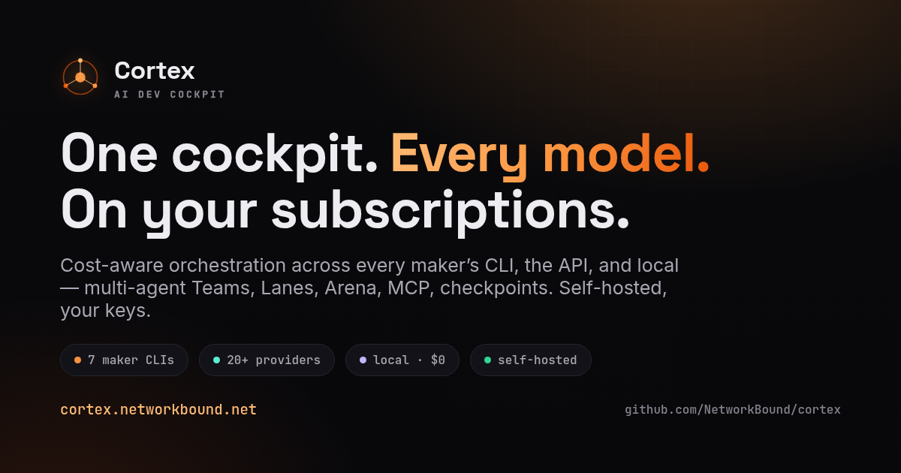

<p align="center">
  
</p>

# Cortex

Cortex is a self-hosted desktop app (Tauri 2, Rust backend, React frontend) for
driving multiple AI coding agents from one window. Instead of juggling separate
terminals for Claude, Codex, Gemini, and friends, you type a task once and
Cortex routes it to a model that can actually do it, runs the work locally, and
records what happened so you can look at it later.

It runs entirely on your own machine. Agent CLIs authenticate with the
subscriptions you already have, API keys are stored in the OS keychain, and
nothing is sent anywhere you didn't configure.

## What it does

**Talks to models three ways.** Maker CLIs (Claude, Codex, Gemini, Qwen, Grok,
aider, Mistral Vibe) run as subprocesses under their own logins, so usage bills
against your existing plan rather than metered API tokens. OpenAI-compatible
APIs (Groq, Together, Fireworks, DeepSeek, Mistral, xAI, Perplexity,
OpenRouter, and others) connect with a base URL and a key. Local runtimes
(Ollama, LM Studio, vLLM, llama.cpp, TabbyAPI, Text-Gen-WebUI) connect over
localhost and cost nothing.

**Routes by capability first, cost second.** The router checks what a model can
do before it checks the price, so a chat-only model never gets handed shell
access. Among capable models, cheaper wins, and a free local model wins ties.
You can always pick a model explicitly instead. A gateway deployment is
optional; the local CLIs work standalone.

**Runs multi-agent work when it helps.** Teams pairs a manager model with
specialist workers. Lanes runs the same task across several providers in
isolated git worktrees so their edits can't collide. Arena runs two models
head-to-head on one prompt and keeps an ELO leaderboard of the results.

**Shows you what your agents did.** Every run is recorded to a local SQLite
store. Run Replay plays any past run back as a timeline: the prompt, why that
model was chosen, each tool call and approval, file edits, errors, and the
per-run cost. The Reliability Dashboard aggregates that history into
per-provider and per-model success rates, p50/p95 latency, token totals, and
estimated cost, with CSV/JSON export. Both are read-only views of local data.

**Reaches models anywhere on your network.** The Model Fabric lets you register
any OpenAI-compatible endpoint, such as a vLLM or llama.cpp box on your LAN or
tailnet, health-check it, discover its models, and chat through it. A companion
HTTP server plus Tailscale gives you access from a phone or tablet browser.

**Keeps context close at hand.** The Brain indexes chat history and an Obsidian
vault with local embeddings for semantic search; `@brain` pulls relevant notes
into a message. Other `@` tokens (`@diff`, `@recent`, `@status`, `@grep`,
`@web`, `@file`, `@summary`) inject live project context. An MCP client with a
server catalog gives every model the same tools. Checkpoints snapshot the
workspace independently of git, and `/undo` shows the exact diff before rolling
anything back.

**Tries not to let an agent wreck your machine.** Commands run in an
untrusted-by-default sandbox with a safe-command allowlist. Plan mode blocks
write and exec tools entirely. Secrets stay in the OS keychain, updates are
ed25519-signed, and there is no telemetry or call-home.

There is more (voice input, image attachments, a terminal, workflows, custom
agent roles, an eval harness), but the above is the core of it. See
[CHANGELOG.md](CHANGELOG.md) for the full history.

## Install

Prebuilt packages are on the [releases page](https://github.com/NetworkBound/cortex/releases/latest):

| Platform | File |
|---|---|
| Linux (universal) | `Cortex_*_amd64.AppImage` (`chmod +x`, then run) |
| Debian / Ubuntu | `Cortex_*_amd64.deb` |
| Fedora / RHEL | `Cortex-*.x86_64.rpm` |
| macOS (Apple Silicon / Intel) | `Cortex_*_aarch64.dmg` / `Cortex_*_x64.dmg` |
| Windows 10/11 | `Cortex_*_x64-setup.exe` (per-user, no admin required) |

The Windows and macOS builds are not code-signed yet, so SmartScreen and
Gatekeeper will warn on first launch.

## Build from source

You need Node 20+, pnpm, and a Rust toolchain.

```bash
pnpm install
pnpm tauri dev      # development build with hot reload
```

Linux release build:

```bash
pnpm tauri:build:linux
```

This runs `tauri build` with `NO_STRIP=true` (needed for AppImage bundling on
modern glibc) and `--remap-path-prefix` so your home directory doesn't end up
in the binary. Output lands in `src-tauri/target/release/bundle/{appimage,deb,rpm}/`.

Windows release build (PowerShell; needs VS Build Tools with the C++ workload
and the WebView2 runtime):

```powershell
pnpm install
$env:RUSTFLAGS = "--remap-path-prefix=$($env:USERPROFILE)="
pnpm tauri build
```

Output: `src-tauri\target\release\bundle\{nsis,msi}\`. Distribute the NSIS
`-setup.exe`; the MSI requires admin. See [docs/WINDOWS-BUILD.md](docs/WINDOWS-BUILD.md)
for signing options.

## Status and limitations

Cortex is a personal homelab project maintained by one developer. It works, and
it is used daily, but expect rough edges:

- Installers are unsigned until a code-signing certificate is provisioned.
- Reliability metrics are computed from local run history only; the dashboard
  can't see retries that happen inside a gateway, and cost figures are
  estimates. The UI labels them as such.
- Model Fabric routing is explicit for now: you pick the endpoint's model in
  the composer. Automatic local-first routing is planned but not built.
- Architecture notes live in [docs/ARCHITECTURE.md](docs/ARCHITECTURE.md), and
  the data-handling policy in [docs/PRIVACY.md](docs/PRIVACY.md).

## Links

- Website: https://cortex.networkbound.net
- Releases: https://github.com/NetworkBound/cortex/releases
