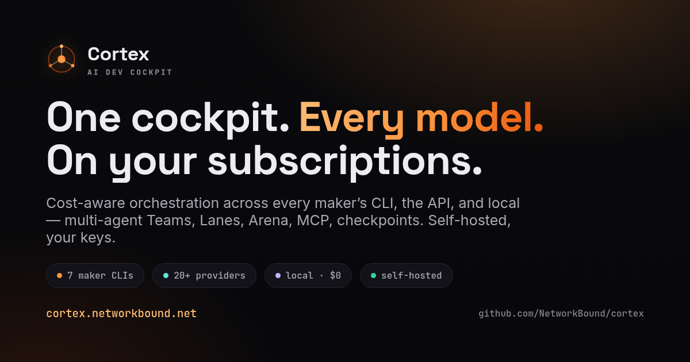

<p align="center">
  
</p>

# Cortex

Cortex is a self-hosted desktop app (Tauri 2, Rust backend, React frontend) for
driving multiple AI coding agents from one window. Instead of juggling separate
terminals for Claude, Codex, Gemini, and friends, you type a task once and
Cortex routes it to a model that can actually do it, runs the work locally, and
records what happened so you can look at it later.

It runs entirely on your own machine. Agent CLIs authenticate with the
subscriptions you already have, API keys are stored in the OS keychain, and
nothing is sent anywhere you didn't configure.

## What it does

**Talks to models three ways.** Maker CLIs (Claude, Codex, Gemini, Qwen, Grok,
aider, Mistral Vibe) run as subprocesses under their own logins, so usage bills
against your existing plan rather than metered API tokens. OpenAI-compatible
APIs (Groq, Together, Fireworks, DeepSeek, Mistral, xAI, Perplexity,
OpenRouter, and others) connect with a base URL and a key. Local runtimes
(Ollama, LM Studio, vLLM, llama.cpp, TabbyAPI, Text-Gen-WebUI) connect over
localhost and cost nothing.

**Routes by capability first, cost second.** The router checks what a model can
do before it checks the price, so a chat-only model never gets handed shell
access. Among capable models, cheaper wins, and a free local model wins ties.
You can always pick a model explicitly instead. A gateway deployment is
optional; the local CLIs work standalone. Claude Code turns resume the CLI's
own session rather than replaying the transcript, and an optional failover
chain re-sends a turn to another agent when one runs out of quota.

**Runs multi-agent work when it helps.** Teams pairs a manager model with
specialist workers. Lanes runs the same task across several providers in
isolated git worktrees so their edits can't collide. Arena runs two models
head-to-head on one prompt and keeps an ELO leaderboard of the results.

**Shows you what your agents did.** Every run is recorded to a local SQLite
store. Run Replay plays any past run back as a timeline: the prompt, why that
model was chosen, each tool call and approval, file edits, errors, and the
per-run cost. The Reliability Dashboard aggregates that history into
per-provider and per-model success rates, p50/p95 latency, token totals, and
estimated cost, with CSV/JSON export. Both are read-only views of local data.

**Reaches models anywhere on your network.** The Model Fabric lets you register
any OpenAI-compatible endpoint, such as a vLLM or llama.cpp box on your LAN or
tailnet, health-check it, discover its models, and chat through it. A companion
HTTP server (`127.0.0.1:8788`) serves a mobile PWA, and an embedded userspace
Tailscale sidecar (`cortex-tsnet`) gives you access from a phone or tablet
without touching the host's networking. ntfy or Gotify push tells your phone
when a run needs approval or finishes, and a tap opens the approval.

**Works with the agents you already use.** Cortex can act as an MCP server,
so Claude Code, Codex or Gemini CLI running in your own terminal can search
the Brain and create checkpoints through it. `/review` has a second model,
from a different provider, review your uncommitted diff before you commit.

**Keeps context close at hand.** The Brain indexes chat history and an Obsidian
vault with local embeddings for semantic search; `@brain` pulls relevant notes
into a message. Other `@` tokens (`@diff`, `@recent`, `@status`, `@grep`,
`@web`, `@file`, `@summary`) inject live project context. An MCP client with a
server catalog gives every model the same tools. Checkpoints snapshot the
workspace independently of git, and `/undo` shows the exact diff before rolling
anything back.

**Tries not to let an agent wreck your machine.** Tool calls pass through a
three-tier sandbox (read-only, workspace-write, full access; workspace-write by
default, so writes outside the project root are refused), a safe-command
allowlist, and per-project command policies. Plan mode blocks write and exec
tools entirely.
Secrets stay in the OS keychain, the Linux AppImage self-update verifies an
ed25519 signature before it swaps a binary in, and there is no telemetry or
call-home.

**Phone app.** The same client ships as a native iOS/Android app
(`mobile/native`, Capacitor): pair it with your desktop by scanning a QR code,
then chat, approve tool calls, browse projects and replay runs from your phone
over Tailscale or your LAN. The phone is a client only; the models, agents and
files stay on your machine. See [docs/MOBILE.md](docs/MOBILE.md).

There is more (voice input, image attachments, a terminal, workflows, custom
agent roles, an eval harness), but the above is the core of it. See
[CHANGELOG.md](CHANGELOG.md) for the full history.

## Install

Prebuilt packages are on the [releases page](https://github.com/NetworkBound/cortex/releases/latest):

| Platform | File |
|---|---|
| Linux (universal) | `Cortex_*_amd64.AppImage` (`chmod +x`, then run) |
| Debian / Ubuntu | `Cortex_*_amd64.deb` |
| Fedora / RHEL | `Cortex-*.x86_64.rpm` |
| macOS (Apple Silicon / Intel) | `Cortex_*_aarch64.dmg` / `Cortex_*_x64.dmg` |
| Windows 10/11 | `Cortex_*_x64-setup.exe` (per-user, no admin required) |
| Android | `Cortex-*-android-debug.apk` (sideload; debug-signed) |
| iOS | TestFlight — see [docs/MOBILE.md](docs/MOBILE.md) |

The Windows and macOS builds are not code-signed yet, so SmartScreen and
Gatekeeper will warn on first launch. The Linux packages need
`libwebkit2gtk-4.1` and GTK 3 (the `.deb` declares them; on Fedora install
`webkit2gtk4.1`). The Windows installer needs the WebView2 runtime, which is
preinstalled on Windows 11 and downloaded by the installer on Windows 10.

## Build from source

You need Node 20+ with pnpm, a Rust toolchain, and Go 1.26+ (the Tailscale
sidecar is a Go program). Linux additionally needs the Tauri system packages;
`scripts/setup-dev.sh` installs them on apt/dnf/pacman/zypper systems and
builds the sidecar for you.

```bash
pnpm install
bash scripts/build-tsnet-sidecar.sh   # -> src-tauri/binaries/cortex-tsnet-<triple>
pnpm tauri dev                        # development build with hot reload
```

`tauri dev` and `tauri build` also build the phone web app in `mobile/`, which
is bundled into installers as a resource. A bare `cargo check` or `cargo test`
needs it built once first: `pnpm build:mobile`.

The sidecar step is not optional: `tauri.conf.json` declares it as an
`externalBin`, and Tauri's build script fails with
`resource path binaries/cortex-tsnet-<triple> doesn't exist` if it is missing,
even for `tauri dev` and `cargo check`. On Windows run the script from Git Bash,
or do it by hand in PowerShell:

```powershell
cd sidecar\cortex-tsnet
$env:CGO_ENABLED = "0"
go build -trimpath -ldflags="-s -w" -o ..\..\src-tauri\binaries\cortex-tsnet-x86_64-pc-windows-msvc.exe .
```

Linux release build (`.deb` + AppImage, then patches the AppImage to prefer the
host's WebKit so it renders on distros with a newer Mesa):

```bash
bash scripts/build-linux.sh
```

or just the Tauri step, which needs `NO_STRIP=true` for AppImage bundling on
current glibc and uses `--remap-path-prefix` so your home directory doesn't end
up in the binary:

```bash
pnpm tauri:build:linux
```

Output lands in `src-tauri/target/release/bundle/{appimage,deb,rpm}/`.

Windows release build (PowerShell; needs Visual Studio Build Tools with the
C++ workload, the WebView2 runtime, and the sidecar built as above):

```powershell
pnpm install
$env:RUSTFLAGS = "--remap-path-prefix=$($env:USERPROFILE)="
pnpm tauri build --bundles nsis
```

Output: `src-tauri\target\release\bundle\nsis\Cortex_<ver>_x64-setup.exe`.
Distribute the NSIS `-setup.exe`; the MSI (`--bundles msi`) always requires
admin. `tauri.conf.json` names the maintainer's local self-signed certificate
under `bundle.windows.certificateThumbprint`; on any other machine either
delete that key or point it at your own certificate, otherwise `signtool` fails
the build. See [docs/WINDOWS-BUILD.md](docs/WINDOWS-BUILD.md) for the signing
options and the Linux-to-Windows cross-build.

Checks that CI runs on every push (Linux and Windows): `pnpm check` (typecheck,
eslint, `cargo check --all-targets`), `pnpm build`, and `pnpm test`
(`cargo test`). See [docs/CONTRIBUTING.md](docs/CONTRIBUTING.md).

## Status and limitations

Cortex is a personal homelab project maintained by one developer. It works, and
it is used daily, but expect rough edges:

- Installers are unsigned until a code-signing certificate is provisioned.
- Reliability metrics are computed from local run history only; the dashboard
  can't see retries that happen inside a gateway, and cost figures are
  estimates. The UI labels them as such.
- Model Fabric routing is explicit for now: you pick the endpoint's model in
  the composer. Automatic local-first routing is planned but not built.
- Architecture notes live in [docs/ARCHITECTURE.md](docs/ARCHITECTURE.md), and
  the data-handling policy in [docs/PRIVACY.md](docs/PRIVACY.md).

## Links

- Website: https://cortex.networkbound.net
- Releases: https://github.com/NetworkBound/cortex/releases
